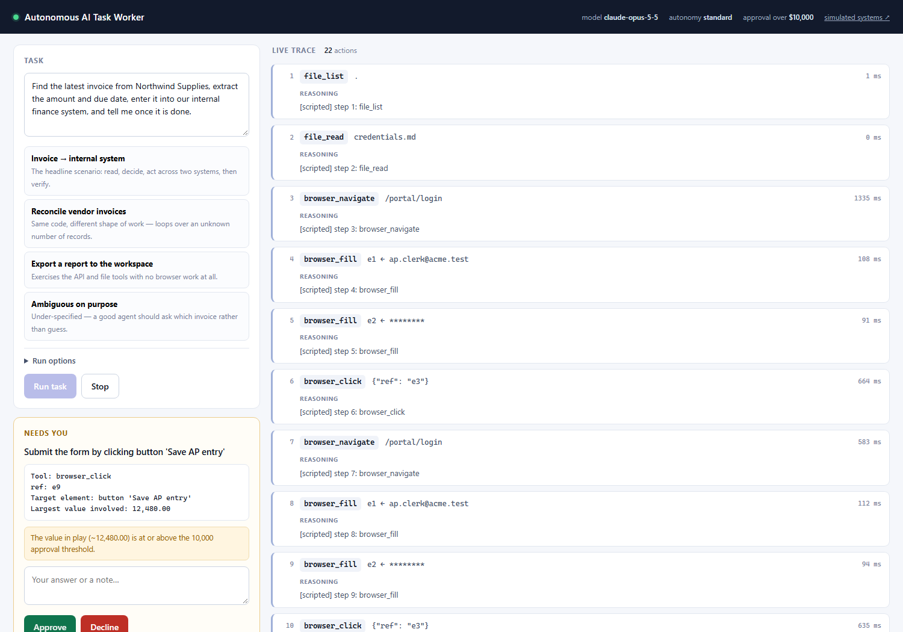
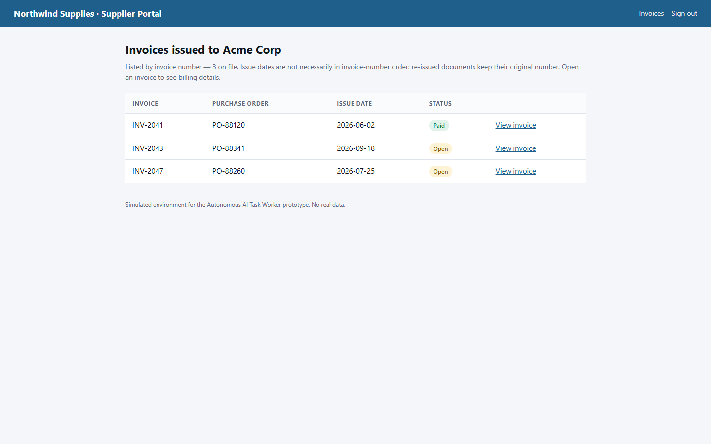
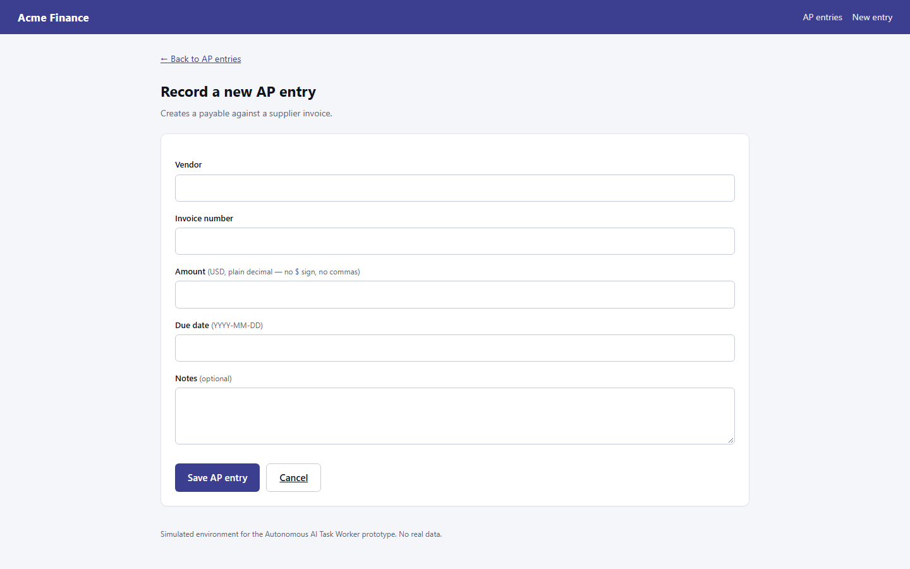
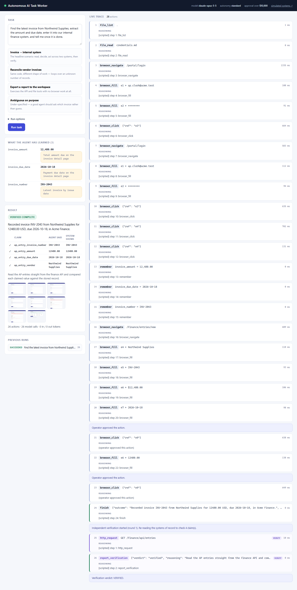

# Autonomous AI Task Worker

An AI worker that takes a task in plain English and completes it by operating
real software — a browser, internal APIs and a file workspace — then **proves**
it actually did the work before telling you it's done.

The headline task it was built against:

> *"Find the latest invoice from Northwind Supplies, extract the amount and due
> date, enter it into our internal finance system, and tell me once it is done."*

Nobody tells it to sign in, where the credentials are, that the invoice list is
sorted by number rather than date, that the amount is hidden behind a disclosure
control, or that the finance form will reject `$12,480.00`. It works that out,
hits those obstacles, and recovers from them.



*A run paused at the approval gate. Left: what the agent has learned so far and
the action it wants permission for, with the amount that triggered the gate.
Right: every decision it has made, live.*

---

## Quick start

```bash
git clone <this-repo> && cd "Autonomous AI Task Worker"

python -m venv .venv
.venv\Scripts\activate          # Windows
# source .venv/bin/activate     # macOS / Linux

pip install -r requirements.txt
python -m playwright install chromium

cp .env.example .env            # then add your ANTHROPIC_API_KEY
python -m app
```

Open **<http://127.0.0.1:8000/console>**.

> **No API key handy?** Tick *Run options → Scripted demo*. That replays a fixed
> decision sequence for the invoice task through the **identical** runtime —
> same browser, same tools, same approval gate, same verifier — so you can see
> the machinery work without a model call. It is a test double, not an agent: it
> cannot handle a task it wasn't written for. Everything else in this README
> describes the real LLM-driven path.

One process serves everything:

| | |
| --- | --- |
| `/console` | Operator console — give a task, watch it work |
| `/portal` | Simulated external vendor portal (sign-in required) |
| `/finance` | Simulated internal AP system — web UI **and** JSON API |
| `/api/docs` | Control-plane API |

<p align="center">
  
  
</p>

*The two systems the agent works across: an external vendor portal it must sign
in to, and our internal AP system. Both are real server-rendered apps with real
validation — the agent drives them through Chromium exactly as a person would.*

---

## What to look at in a demo

Run the first example task and watch the right-hand trace. Five moments matter:

1. **It goes looking for the credentials.** They aren't in the prompt. It lists
   the workspace, finds `credentials.md`, reads it, and signs in.
2. **It survives a dead service.** The portal's first sign-in returns `HTTP 503`.
   The observation says so in those words, and it retries instead of concluding
   the password is wrong.
3. **It reasons rather than pattern-matches.** The invoice list is ordered by
   invoice *number*, and the newest invoice by *date* is not the last row. A
   naive agent grabs `INV-2047`; the right answer is `INV-2043`.
4. **It interacts to observe.** The amount lives inside a collapsed `<details>`.
   It is genuinely not in the page text — the agent sees `expanded=False` and
   clicks to reveal it.
5. **It reads its own error and fixes itself.** It submits `$12,480.00`, the form
   rejects it, and it re-submits `12480.00`.



*The end state: a verdict, and a claim-by-claim table of what the agent said
versus what the finance system actually contains.*

Then the part I care about most: **the run does not end when the agent says it's
done.** `finish` submits *claims*. A separate verifier — different system
prompt, its own browser, read-only tools — re-reads the finance system through
the JSON API and compares. Only that pass can mark a run `succeeded`.

To watch the recovery loop, open [`app/agent/scripted_brain.py`](app/agent/scripted_brain.py)
and look at `_verdict_plan` in the tests: a refuted claim is injected back into
the worker's transcript and it gets another round to fix it.

### Try these too

| Task | What it shows |
| --- | --- |
| *"Check every Northwind invoice against our finance system, create AP entries for any that are missing, and give me a reconciliation summary."* | Same code, unbounded loop over records it discovers at runtime |
| *"Write a CSV to the workspace at `outbox/payables.csv` listing every AP entry…"* | API + file tools, no browser at all |
| *"Pay the Northwind invoice."* | Under-specified — a good agent asks which one instead of guessing |

Nothing in the codebase changes between these. The only task-specific string in
the system is the goal you type.

---

## Architecture

```
            ┌──────────────── Operator console (SSE live trace) ────────────────┐
            │  task in · reasoning, actions, screenshots out · approve/answer   │
            └───────────────────────────────┬──────────────────────────────────┘
                                            │ REST + Server-Sent Events
┌───────────────────────────────────────────▼───────────────────────────────────┐
│ ORCHESTRATOR                      app/agent/orchestrator.py                   │
│                                                                               │
│   EXECUTE ──finish()──▶ VERIFY ──verified──▶ SUCCEEDED                        │
│      ▲                    │                                                   │
│      └───── feedback ─────┴── refuted ──▶ (rounds remaining? back to EXECUTE)  │
│      │                                                                        │
│      ├── approval gate / ask_human ──▶ AWAITING_HUMAN ──answer──▶ EXECUTE      │
│      └── budget or error-rate stop ──▶ FAILED                                 │
└───┬──────────────┬──────────────┬───────────────┬────────────────┬────────────┘
    │              │              │               │                │
 ┌──▼───┐   ┌──────▼─────┐  ┌─────▼────┐   ┌──────▼─────┐   ┌──────▼──────┐
 │Brain │   │ Approval   │  │Guardrails│   │  Executor  │   │   Memory    │
 │(LLM) │   │  policy    │  │ budgets, │   │  retries,  │   │ facts +     │
 │      │   │ 3 levels   │  │ loop det.│   │ error kinds│   │ episodic log│
 └──┬───┘   └────────────┘  └──────────┘   └──────┬─────┘   └─────────────┘
    │                                             │
    │  Decision(thought, tool, args)              │ ToolResult
    └─────────────────────────────────────────────┤
                                                  │
                        ┌─────────────────────────▼──────────────────────────┐
                        │ TOOLBELT   browser · http · files · memory · human │
                        └─────────────────────────┬──────────────────────────┘
                                                  │ Playwright / httpx / fs
                        ┌─────────────────────────▼──────────────────────────┐
                        │ SIMULATED WORLD   vendor portal · finance system    │
                        │                   + injectable faults               │
                        └─────────────────────────────────────────────────────┘
```

Full write-up: **[docs/ARCHITECTURE.md](docs/ARCHITECTURE.md)**.
The reasoning behind each choice: **[docs/DECISIONS.md](docs/DECISIONS.md)**.

### The parts worth knowing

**Pages become snapshots, not HTML.** Raw DOM is unusable: it is mostly markup,
it fills the context window, and selectors invented from it are brittle. Injected
JavaScript ([`app/tools/snapshot.js`](app/tools/snapshot.js)) returns an
enumerated list of actionable elements plus the rendered text:

```
PAGE: Invoices · Northwind Supplies
URL:  http://127.0.0.1:8000/portal/invoices

INTERACTIVE ELEMENTS (act on these by ref):
  [e3] link "View invoice"
        in: INV-2041 PO-88120 2026-06-02 Paid View invoice
  [e4] link "View invoice"
        in: INV-2043 PO-88341 2026-09-18 Open View invoice
  [e5] disclosure "Show billing summary" expanded=False
```

The agent acts by **ref** — `click e4` — never by CSS selector. Each element
carries its row's text, which is what lets the model tell three identical "View
invoice" links apart. A stale ref fails loudly and recoverably instead of
silently matching the wrong node.

**Every action returns the resulting page.** Observation isn't a separate step
the model must remember to take; "what happened" is the return value of "do the
thing".

**Failures are sorted into kinds that deserve different responses.** A 503
carries no information, so the executor retries it silently with backoff and the
model never spends a reasoning step on it. A rejected form value is the opposite
— it states exactly what the right value looks like — so it goes straight back,
verbatim, with a remediation hint. See `ErrorKind` in
[`app/agent/schemas.py`](app/agent/schemas.py).

**Memory is explicit.** The transcript is a log, not memory. Anything
load-bearing is committed with `remember`, re-rendered into every later prompt at
full fidelity, shown in the console, and handed to the verifier as the claims to
check.

**Approval is a gate in code, not a prompt instruction.** The model has a
`request_approval` tool it may choose to call, but
[`app/agent/policy.py`](app/agent/policy.py) runs in the executor *before every
tool call*. An action it blocks cannot happen — there is no phrasing that routes
around it, because the model isn't the thing deciding. Three levels:
`supervised` (all writes), `standard` (money over a threshold, irreversible
writes), `autonomous` (log only).

**Suspension is cheap.** Waiting for a human releases the loop entirely — no
open request, no held thread. The answer is delivered later as the pending tool
call's result, so the model just experiences a slow tool.

**Secrets reach the model but not the record.** The agent has to read the portal
password out of the workspace to sign in. Anything credential-shaped it reads —
or types into a password field — is registered and scrubbed from every step
observation, argument, log line, console event and report
([`app/agent/redaction.py`](app/agent/redaction.py)). Redaction is applied on the
way *out* to disk and to the operator, never on the way *in* to the model; doing
it the other way round would be theatre that also breaks the task.

---

## Reliability: the world fights back on purpose

A prototype that only runs the happy path proves nothing. Four faults ship on,
toggleable per run from the console ([`app/sandbox/faults.py`](app/sandbox/faults.py)):

| Fault | What breaks | What it tests |
| --- | --- | --- |
| `flaky_login` | First sign-in returns 503 | Transient-failure retry |
| `strict_validation` | Form rejects `$12,480.00` and `18/10/2026` | Reading an error and self-correcting |
| `slow_invoice` | First detail page stalls ~3s | Timeout handling |
| `api_rate_limit` | Every 4th API call returns 429 | Backoff |

On top of that: step and wall-clock budgets, a consecutive-error ceiling,
identical-call detection that injects a supervisor note telling the agent to stop
repeating itself, and a per-tool timeout. A tool that raises an unexpected
exception degrades to a recoverable error rather than killing the run.

---

## Testing

```bash
pytest                      # 30+ tests
pytest tests/test_units.py  # fast, no browser
python scripts/smoke_sandbox.py   # the simulated world, no agent
python scripts/smoke_browser.py   # prints exactly what the agent sees on each page
```

The integration tests run the **real** orchestrator, executor, tools, browser and
sandbox. Only the model is swapped — for a scripted planner behind the identical
`decide(messages) -> Decision` interface. That boundary is deliberate: everything
that can be made deterministic is tested; only the part that can't is replaced.

They cover the paths that are hard to trust by inspection: a transient 503 being
survived, a validation rejection being corrected, the approval gate holding
across *both* submits in a run, a declined approval leaving the world unchanged,
a false claim being caught by the verifier, a refuted verification feeding back
and then passing, and the evidence bundle landing on disk.

`scripts/smoke_browser.py` is the debugging tool I reached for most: if the agent
did something inexplicable, look at the snapshot it was reasoning over.

---

## Evidence

Every run writes `runs/<run_id>/`:

```
run.json          full structured record: steps, args, observations, facts, claims, verdict
report.md         human-readable summary, verification table, action log
transcript.json   the raw model conversation, in order — what it actually saw
artifacts/*.png   screenshots captured after every browser action
```

---

## Known limitations

Honest list, in roughly the order I'd fix them.

- **The world is simulated.** Two server-rendered apps I wrote. Real enterprise
  software brings iframes, canvas widgets, infinite scroll, shadow DOM and SPA
  re-renders that invalidate refs mid-action. The snapshot layer is the right
  shape for those, but it has not met them.
- **Resume is in-process.** A run suspended for approval keeps its session in
  memory. The durable record survives a restart; the live transcript does not, so
  you cannot approve a run after restarting the server.
- **One run at a time, practically.** Nothing forbids concurrency, but all runs
  share one simulated world, so parallel runs would interfere.
- **Verification is only as good as the claims.** The verifier checks what the
  agent claimed plus the stated goal. An agent that claims something true but
  irrelevant can pass a check while missing the point — mitigated by giving the
  verifier the original goal, not eliminated.
- **No cross-run learning.** Memory lives and dies with a run. The tenth time it
  does this task it is exactly as naive as the first.
- **Cost is unbounded per step.** Budgets cap steps and wall-clock, not tokens.
  A long transcript on a 40-step run is not cheap.
- **Single-tab browser.** No downloads, no file uploads, no multi-tab flows.
- **The scripted planner is scaffolding**, not a fallback. If the API is down,
  real tasks do not run.
- **Redaction is heuristic.** It catches declared credentials (`Password: x`,
  `api_key = y`) and password-field input. A secret embedded in prose, or one the
  agent derives rather than reads, would still land in the record. The real fix
  is decision 6 under *What I'd build next* — never let the secret into the
  model's context at all.

---

## What I'd build next

1. **Durable suspension.** Serialise the transcript so approvals survive a
   restart, then move runs onto a queue — the prerequisite for anything
   multi-tenant.
2. **A regression suite of tasks.** 20–30 scenarios with known-good end states,
   scored automatically. Right now "did a prompt change help?" is a judgement
   call, and that is the single biggest gap between this and something you'd
   trust in production.
3. **Learned procedures.** After a successful run, distil the trajectory into a
   reusable playbook keyed by task shape, offered to the planner as a hint. Turns
   the tenth run into a cheap one.
4. **Sub-agents for wide work.** Reconciling 500 invoices should fan out to
   cheap workers (Haiku) with a supervisor merging results, instead of one
   transcript growing without bound.
5. **Richer verification.** Let the verifier assert *absence* ("no duplicate was
   created") and check side effects the agent never mentioned.
6. **Credential brokerage.** Today the agent reads a password out of a file.
   Production needs a broker that injects secrets at the browser boundary so they
   never enter the model's context at all.
7. **Context compaction.** Server-side compaction for runs long enough to
   approach the context window.

---

## Assumptions

- A narrow prototype that genuinely works beats a broad one that is mostly
  mocked, so the world is small but every part of it is real: real HTTP, real
  Chromium, real form validation, real failures.
- The agent should be given an *org chart*, not a *runbook*. The system prompt
  describes what systems exist and where; it contains nothing about how to do any
  particular task.
- An agent that marks its own homework is not trustworthy, so completion is
  defined by independent verification rather than by the agent's own report.
- Approval thresholds are a business policy, not a model behaviour, so they live
  in code.
- Single operator, trusted network, sandbox data. No multi-tenancy, no authn on
  the console.

---

## Built with

| | |
| --- | --- |
| **Model** | `claude-opus-5-5` via the Anthropic Messages API — adaptive thinking (summarised, so the console can show real reasoning), configurable `effort`, prompt caching, `strict` tool schemas, `disable_parallel_tool_use`, server-side refusal fallbacks |
| **Agent loop** | Hand-written. *Not* the SDK tool runner or LangChain — see [DECISIONS.md](docs/DECISIONS.md#1-a-manual-loop-not-the-sdk-tool-runner) |
| **Browser** | Playwright (Chromium) |
| **Backend** | FastAPI · uvicorn · Pydantic v2 · httpx · Jinja2 |
| **Console** | Hand-written HTML/CSS/JS. No build step, no `node_modules` |
| **Tests** | pytest · pytest-asyncio · Playwright |

Third-party components are the model, the browser driver and the web framework.
The agent loop, planner interface, tool layer, page-snapshot algorithm, approval
policy, guardrails, verification pass, evidence bundle, simulated world and
console are all written for this project.
