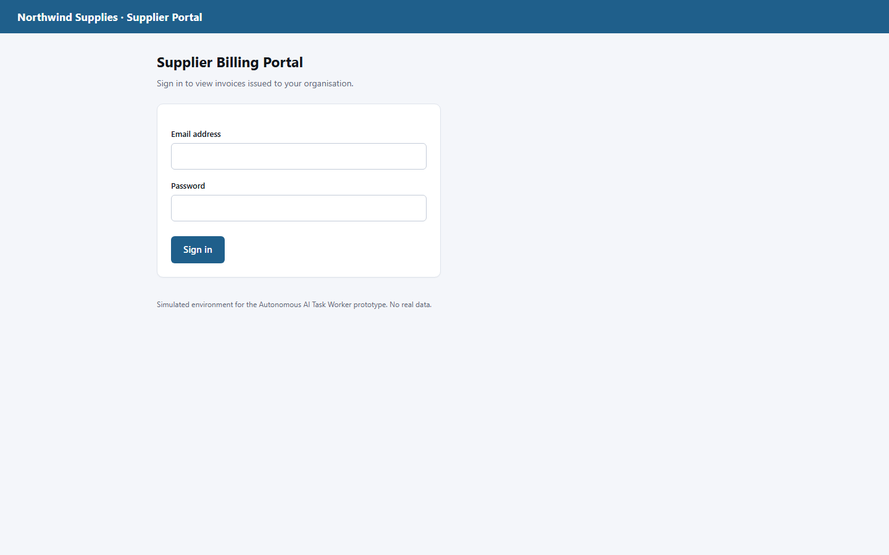
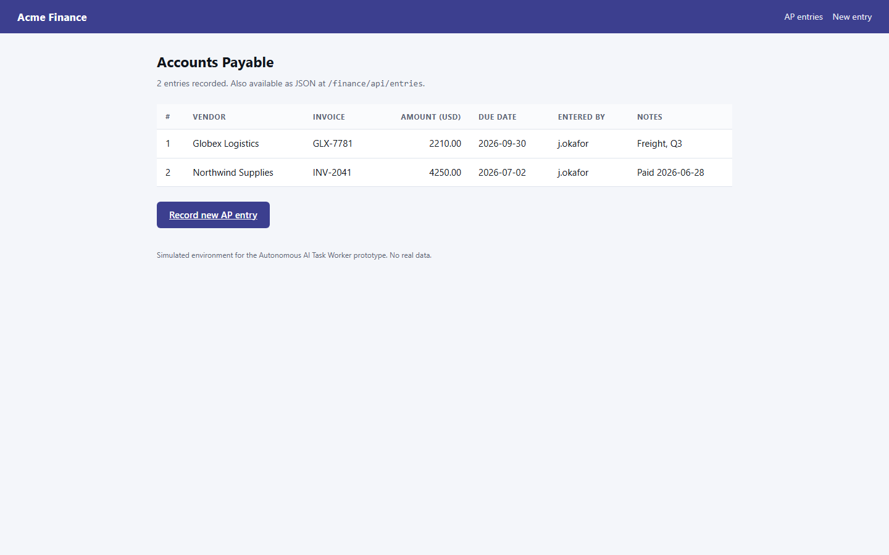

# Architecture

> Written for an engineer reading the code for the first time, or interviewing me
> about it.

## The shape of the problem

A useful autonomous worker has to do seven things, and most prototypes only do
the first two:

1. decide what to do next,
2. actually do it,
3. notice what happened,
4. notice when what happened was *wrong*,
5. do something different in response,
6. know when it is finished,
7. be able to prove it.

Steps 4–7 are where the engineering is. An LLM in a `while` loop gets you 1–3.
Almost everything in this codebase exists to serve 4–7.

---

## Module map

```
app/
├── config.py                 every knob, sourced from env, snapshotted onto each run
├── server.py                 FastAPI: control plane + console + simulated world
│
├── agent/
│   ├── orchestrator.py       the state machine. Start here.
│   ├── brain.py              the only file that knows Claude exists
│   ├── scripted_brain.py     deterministic test double behind the same interface
│   ├── executor.py           tool dispatch: timeouts, retry, error classification
│   ├── policy.py             approval gate (runs before every tool call)
│   ├── guardrails.py         budgets, loop detection, supervisor interventions
│   ├── redaction.py          secret scrubbing on the way out to disk/operator
│   ├── prompts.py            system prompts; the org-chart-not-runbook boundary
│   └── schemas.py            durable types for a run
│
├── tools/
│   ├── base.py               the Tool contract: ToolSpec, ToolResult, ToolError
│   ├── registry.py           assembles worker vs verifier toolbelts
│   ├── snapshot.js           DOM → agent-readable snapshot (injected JS)
│   ├── browser.py            Playwright session + browser tools
│   ├── web_http.py           internal API access (allow-listed)
│   ├── files.py              workspace-sandboxed filesystem
│   ├── memory_tools.py       `remember`
│   ├── human.py              `ask_human`, `request_approval`
│   └── control.py            `finish`, `report_verification`
│
├── runtime/
│   ├── store.py              run persistence + live session registry
│   └── events.py             in-process event bus behind SSE
│
├── sandbox/                  the simulated company
└── web/                      operator console (no build step)
```

---

## The run state machine

`app/agent/orchestrator.py` is the spine.

```
                         ┌──────────────┐
            ┌───────────▶│   EXECUTE    │◀────────────┐
            │            └──────┬───────┘             │
            │                   │                     │
   answer   │          ┌────────┼─────────┐           │ feedback
            │          │        │         │           │ (rounds left)
   ┌────────┴───────┐  │   finish()   gate/ask        │
   │ AWAITING_HUMAN │◀─┘        │         │           │
   └────────────────┘           ▼         └──▶ (suspend, return)
                         ┌──────────────┐
                         │    VERIFY    │
                         └──────┬───────┘
                      verified  │  refuted / inconclusive
                     ┌──────────┴───────────┐
                     ▼                      ▼
                ┌─────────┐          rounds left? ──no──▶ ┌────────┐
                │SUCCEEDED│                               │ FAILED │
                └─────────┘                               └────────┘
```

Three properties this buys:

**The agent cannot mark its own homework.** `finish` does not end a run — it ends
the worker's *turn* and submits claims. Only the verification pass produces
`succeeded`.

**A refuted verification is feedback, not failure.** The discrepancy is appended
to the worker's transcript in plain language, and the loop re-enters EXECUTE with
the browser and memory intact.

**Suspension costs nothing.** Parking for a human returns from the driver
entirely. No thread, no socket, no in-flight API call. `respond()` delivers the
answer as the pending tool call's result and restarts the driver.

---

## The execute loop, one iteration

```
  guardrails.should_stop()?        ──▶ STOPPED (budget / error-rate)
  inject committed facts into transcript
  brain.decide(messages)           ──▶ Decision(thought, tool, args)
     ├─ refusal?                   ──▶ STOPPED
     └─ no tool call?              ──▶ nudge, retry (capped at 3)
  policy.evaluate(tool, args)      ──▶ requires approval? SUSPEND
  executor.run(ctx, spec, args)
     ├─ transient      ──▶ retried here, silently, with backoff
     ├─ invalid_input  ──▶ straight back to the model with a remediation hint
     └─ ok             ──▶ observation
  control signal?  finish → VERIFY | ask_human → SUSPEND
  append tool_result to transcript
  guardrails.intervention()        ──▶ maybe inject a supervisor note
  persist run.json + transcript.json
```

Each line of that is a decision. The ones worth defending are in
[DECISIONS.md](DECISIONS.md).

---

## Observation: how a web page becomes a prompt

This is the most important design choice in the system, because it determines
what the model is capable of noticing.

**Rejected:** raw HTML (mostly markup, enormous, invites hallucinated selectors),
and screenshots-only (needs vision for text that is already text, and gives
nothing to act on reliably).

**Chosen:** injected JavaScript walks the DOM and returns two things — the
elements that can be acted on, each stamped with a short ref written into the DOM
as `data-agentref`, and the page's rendered text.

```
PAGE: INV-2043 · Northwind Supplies · Supplier Portal
URL:  http://127.0.0.1:8000/portal/invoices/INV-2043

INTERACTIVE ELEMENTS (act on these by ref):
  [e1] link "Invoices"
  [e3] link "← Back to invoices"
  [e4] disclosure "Show billing summary" expanded=False

PAGE TEXT:
Invoice INV-2043
Purchase order   PO-88341
Issue date       2026-09-18
Show billing summary
```

Four properties fall out of this:

- **Actions are unambiguous.** `click e4`. The model cannot invent a ref that
  resolves to the wrong element; a stale one fails loudly and recoverably.
- **Identical controls are distinguishable.** Each element carries its nearest
  row/list-item text (`in: INV-2043 PO-88341 2026-09-18 Open View invoice`).
  Three "View invoice" links become three distinct choices.
- **State is legible.** `expanded=False` tells the agent the amount is hidden
  behind a control, which is how it knows to click rather than conclude the data
  is missing.
- **It is bounded.** 150 elements, 4 000 characters of text, with explicit
  truncation markers. A page cannot blow the context window.

Refs are regenerated on every snapshot and only valid for the most recent one —
stated in the system prompt and enforced in `locator_for`.



`python scripts/smoke_browser.py` prints these for the real pages. It is the
first thing to run when the agent does something inexplicable.

---

## Memory

Three layers, deliberately separate:

| Layer | Lives in | Purpose |
| --- | --- | --- |
| **Transcript** | `RunSession.messages` | The model's working context. Append-only. |
| **Facts** | `RunRecord.facts` | Confirmed values, re-rendered into every later prompt. |
| **Episodic record** | `runs/<id>/run.json` | Durable log: every step, arg, observation, artifact. |

The transcript is a *log*, not memory. Over a 30-step run it accumulates tens of
thousands of tokens of page snapshots, and a single number — the invoice total —
is easy to lose track of inside that. So anything load-bearing is committed
explicitly with `remember`. Those facts are re-rendered into the prompt at full
fidelity, shown in the console, handed to the verifier as the claims to check,
and persisted as evidence.

The transcript is never edited — facts are appended as new messages rather than
spliced into history. That keeps it append-only, which is what keeps previously
returned reasoning blocks valid when replayed to the model.

---

## Error handling

`ToolError` carries a `kind` that determines the response, and a `remediation`
string written for the model to read:

| Kind | Response | Why |
| --- | --- | --- |
| `transient` | Executor retries, backoff, model never sees it | A 503 carries no information; thinking about it wastes a step |
| `not_found` | Returned with "take a fresh snapshot" | Usually a stale ref; recoverable in one move |
| `invalid_input` | Returned verbatim, **never auto-retried** | The error states the correct format — retrying identical input is pointless |
| `blocked` | Returned with "do not retry as-is" | Policy or allow-list; needs a different route |
| `fatal` | Aborts the run | Playwright missing, no API key |

Writing a good `remediation` is the highest-leverage reliability work in the
codebase. `"Amount must be a plain decimal number with no currency symbol
(example: 12480.00)"` is the difference between an agent that fixes itself and
one that loops.

Above that sit the guardrails (`guardrails.py`): step and wall-clock budgets, a
consecutive-error ceiling, and identical-call detection that injects a supervisor
note — *"you have called this with identical arguments 3 times; stop repeating
it"* — which in practice is what breaks doom-loops. Each intervention fires once;
repeating the same nag every turn just becomes noise.

---

## Verification

The part that turns "the agent said so" into "it is true".

`finish(outcome, summary, claims)` requires `claims` as structured key/value
pairs an auditor could confirm — `{"ap_entry_amount": "12480.00"}` — not a
description of effort. The verifier then runs as a **separate agent**:

- its own system prompt, written adversarially ("the worker's narrative is a
  claim, not evidence"),
- its own browser session, so it cannot inherit the worker's logged-in state and
  mistake leftover page content for independent evidence,
- **read-only tools only**, assembled by filtering on the `read_only` flag rather
  than by a hand-written list — so a tool added later cannot leak write access
  into verification without opting in,
- `http_request` additionally refuses non-`GET` during the verify phase, enforced
  in the tool itself.

It is told to prefer a *different surface* than the worker used: the worker fills
in a web form, the verifier reads the JSON API. A stale rendered page cannot fool
it.

Verdicts: `verified` → run succeeds. `refuted` → the discrepancy is injected into
the worker's transcript and it gets another round. `inconclusive` → treated as
not verified; this is why "I ran out of steps" cannot pass as success.

---

## Why the worker and the verifier are one engine

They differ only in which toolbelt and system prompt they are handed. Same
orchestrator, same executor, same error handling, same step recording. That is
also why the scripted test double works: it implements `decide(messages) ->
Decision` and the orchestrator cannot tell the difference, so the tests exercise
the real loop rather than a parallel one.

---

## Generalisation

What would have to change to run a different task?

**Nothing.** The only task-specific string in the system is the goal the operator
types. The prompts describe the environment, never a procedure.

What would have to change for a different *environment*? A new `ToolSpec` —
name, description, JSON schema, async handler. The orchestrator, policy,
guardrails, verifier and console all pick it up without modification; the policy
classifies it from its `mutating` flag and the console renders it generically.

The seam the design is betting on: **the orchestrator knows about tools, not
about browsers or invoices.**

---

## Concurrency and lifecycle

Each run is an `asyncio.Task` driving its own Playwright browser and httpx
client, held in a `RunSession` in `RunStore`. The `RunRecord` is written to disk
atomically after every step, so a crashed process still leaves a complete,
inspectable trail.

The split matters: the record is *durable*, the session is *live*. A run
suspended for approval keeps its session resident, which is why resume works
across minutes without holding any request open — and also why resume does not
currently survive a process restart (see Known Limitations in the README).

---

## The simulated world

Two server-rendered apps in the same process, deliberately built with the
friction real systems have:

- **Northwind portal** — sign-in required, credentials only discoverable in the
  workspace; invoices listed by *number* while "latest" means by *date*; billing
  figures inside a collapsed `<details>` so they are genuinely absent from the
  initial page text.


- **Acme Finance** — web form *and* JSON API over the same store, so the agent
  has two routes and the verifier has an independent one. Strict validation with
  actionable error messages.

Faults are injectable per run (`app/sandbox/faults.py`) and their one-shot
counters live on the world object, so resetting the world re-arms them —
otherwise a second run in the same process silently gets an easier environment
than the first.
